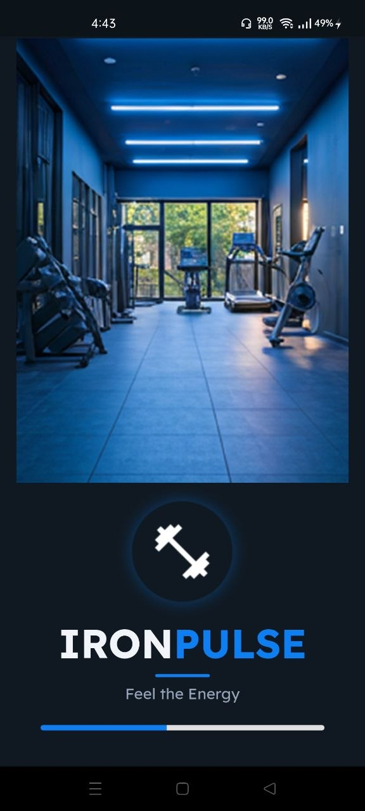
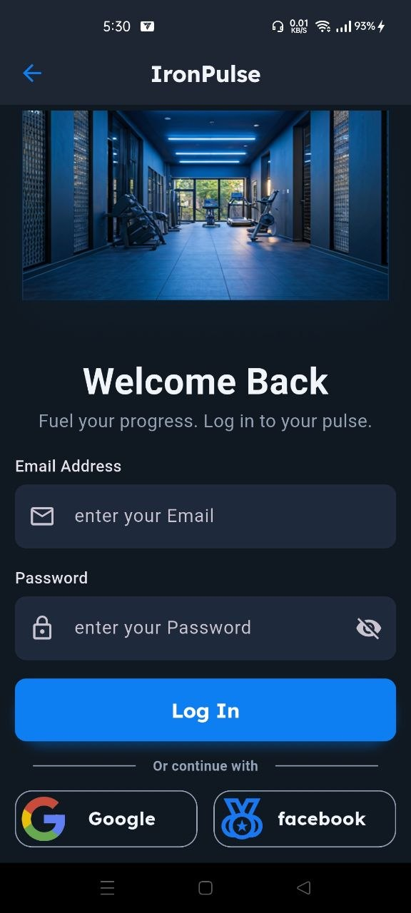
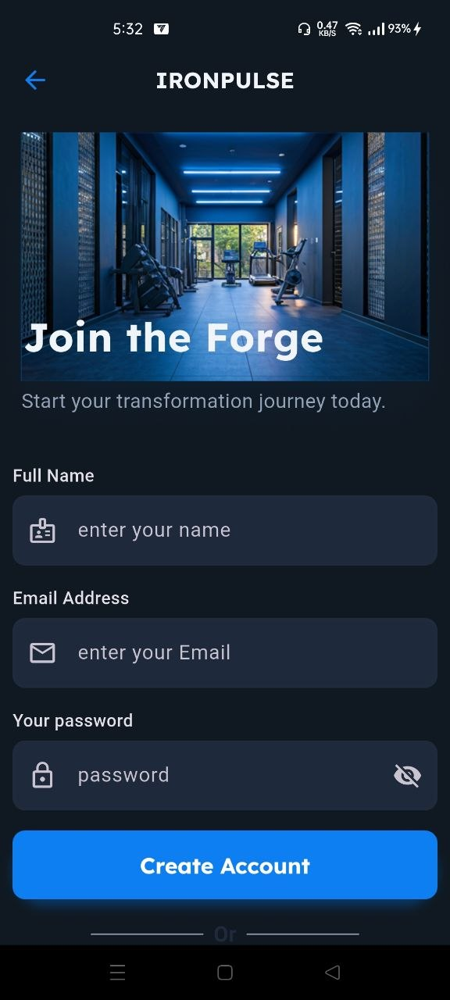
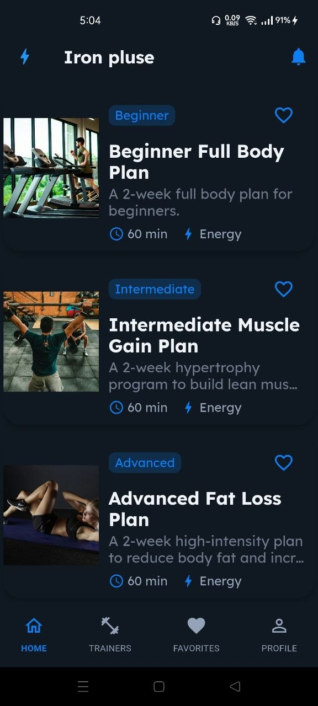
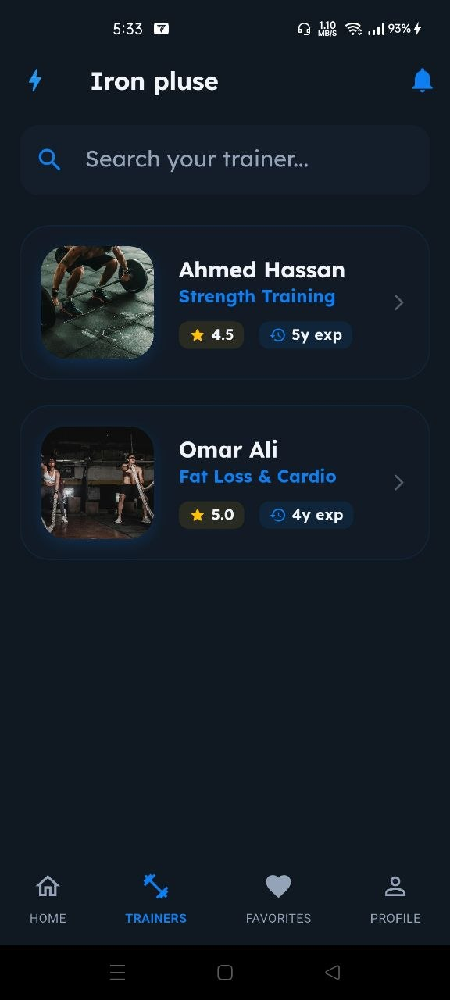
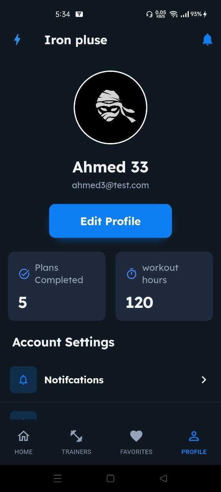

## 📱 About the App

IronPulse is a Flutter Fitness application that allows users to browse training plans, browse trainers, set favorite, create accounts, and manage authentication flows.

It uses Cubit for state management and follows clean architecture principles.

## ✨ Features

- User authentication (Login / Signup)
- Onboarding screen
- Profile View & Edit
- Clean UI design
- State management using Cubit
- Favorite

## 📸 Screenshots

### Splash Screen

  

### Onboarding Screen

  

### Auth Screens

  
  

### Home Screens

  
  
  
  

## 👨‍💻 Developer

- Ahmed ElSayed -> https://github.com/Ahmed582002
- Mohamed Bassiouny -> https://github.com/mbassiony334-alt
- Mostafa Ahmed -> https://github.com/Moustafafx
- Omar -> https://github.com/Omar12-Mo
